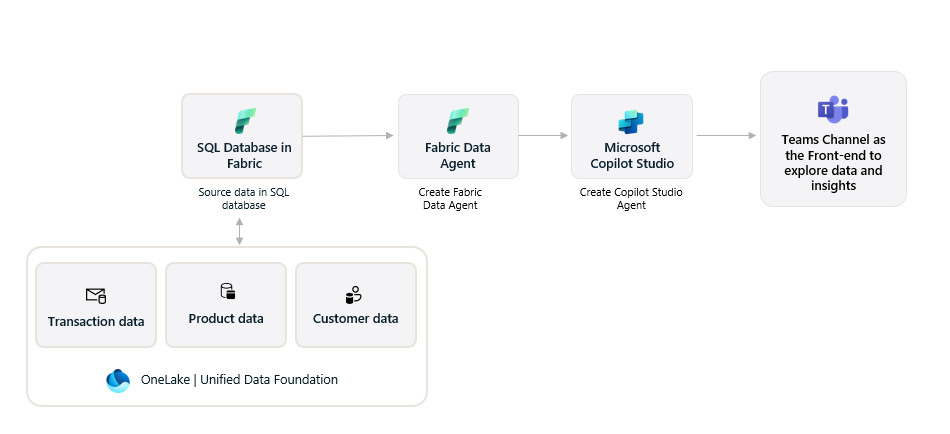
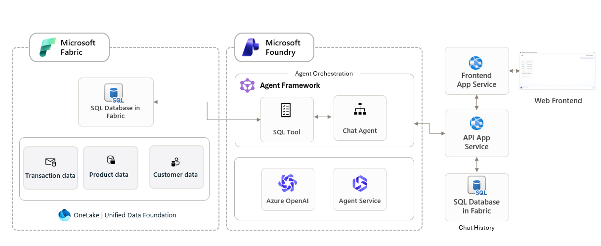
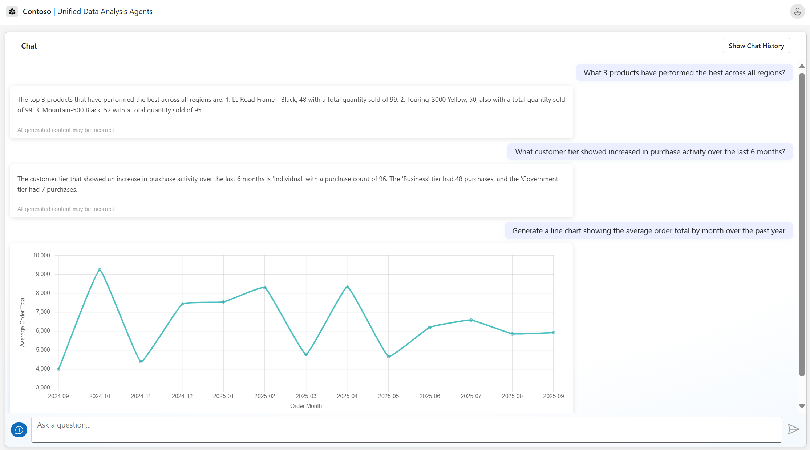

# Microsoft IQ Solution Accelerator

 
This solution accelerator empowers organizations to make faster, smarter decisions at scale by leveraging agentic AI solutions built on a unified data foundation with Microsoft Fabric and Microsoft 365 integration through WorkIQ. With seamless integration of Microsoft Foundry agents, Agent Framework orchestration, and WorkIQ connectivity to Microsoft 365 data (emails, meetings, documents, Teams), teams can design intelligent workflows that automate routine processes, streamline operations, and enable natural language querying across both enterprise datasets and M365 content. This ensures that governed, high-quality data from multiple sources is accessible not only to technical specialists but also to business users, creating a shared environment where insights are surfaced more easily and decisions are grounded in trusted information. By unifying data access across Fabric and Microsoft 365 and applying AI in the flow of work, organizations gain the agility to respond rapidly to changing business needs, foster collaboration across teams, and drive innovation with greater confidence.

 

 

  
[**SOLUTION OVERVIEW**](#solution-overview)  \| [**QUICK DEPLOY**](#quick-deploy)  \| [**BUSINESS SCENARIO**](#business-scenario)  \| [**SUPPORTING DOCUMENTATION**](#supporting-documentation)

 

 **Note:** With any AI solutions you create using these templates, you are responsible for assessing all associated risks and for complying with all applicable laws and safety standards. Learn more in the transparency documents for [Agent Service](https://learn.microsoft.com/en-us/azure/ai-foundry/responsible-ai/agents/transparency-note) and [Agent Framework](https://github.com/microsoft/agent-framework/blob/main/TRANSPARENCY_FAQ.md).
 

<h2>
Solution overview
</h2>

Leverages the Unified Data Foundation in Fabric accelerator, SQL Database in Fabric, Agent Framework, AI Foundry, and WorkIQ integration to query both structured data and Microsoft 365 content. Structured data sets and M365 data (emails, meetings, documents, Teams messages) are analyzed through intelligent and orchestrated responses powered by an interactive web front-end for exploring semantic models, data assets, and enterprise content. Insights are generated using natural language queries across both data sources.

### Solution architecture

Microsoft Fabric and Microsoft Copilot Studio:
|
|---|

Microsoft Fabric and Microsoft Foundry: 
|
|---|

### Additional resources

[Technical Architecture](./documents/TechnicalArchitecture.md)

## Features
### Key features

  

Click to learn more about the key features this solution enables
  

**Built on Microsoft Fabric + Microsoft Foundry + WorkIQ**
- **Unified data foundation with Fabric**    
Leverage the foundational capabilities of Microsoft Fabric and a Unified Data Foundation to build intelligent agents that stand apart in orchestration, retrieval, and user experience

- **Microsoft 365 integration via WorkIQ**    
Query emails, meetings, documents, Teams messages, and people data directly through natural language using the WorkIQ MCP integration. Seamlessly combine enterprise data insights with Microsoft 365 content.

- **Governed data at scale**    
Seamlessly integrate with Fabric's data foundation to ensure performance, scalability, and extensibility.

- **Multi-source natural language interaction**    
Microsoft Foundry Agents coordinate orchestration and retrieval across structured data, knowledge bases, and Microsoft 365 content to deliver fast, contextual answers. Enable intuitive, natural language querying capabilities that unify access across enterprise data assets and M365 workspace content.

## Getting Started

###  Quick deploy

#### How to install or deploy
Follow the quick deploy steps on the deployment guide to deploy this solution to your own Azure subscription.

For Azure Deployment: [Click here to launch the deployment guide](./documents/DeploymentGuide.md)
  
For Local Development: 
- [Local Development Setup Guide](./documents/LocalDevelopmentSetup.md) - Comprehensive setup instructions for Windows and Linux.
- Includes native Windows setup, WSL2 configuration, and cross-platform development tools

For Workshop: [Workshop Guide](https://microsoft.github.io/agentic-applications-for-unified-data-foundation-solution-accelerator/quick-deploy/deployment-guide-optionA/) - A hands-on, step-by-step walkthrough for building AI agents that combine unstructured document knowledge with structured enterprise data.
  

|  |  | [&message=Open&color=blue&logo=visualstudiocode&logoColor=white)](https://vscode.dev/azure/?vscode-azure-exp=foundry&agentPayload=eyJiYXNlVXJsIjogImh0dHBzOi8vcmF3LmdpdGh1YnVzZXJjb250ZW50LmNvbS9taWNyb3NvZnQvYWdlbnRpYy1hcHBsaWNhdGlvbnMtZm9yLXVuaWZpZWQtZGF0YS1mb3VuZGF0aW9uLXNvbHV0aW9uLWFjY2VsZXJhdG9yL3JlZnMvaGVhZHMvbWFpbi9pbmZyYS92c2NvZGVfd2ViIiwgImluZGV4VXJsIjogIi9pbmRleC5qc29uIiwgInZhcmlhYmxlcyI6IHsiYWdlbnRJZCI6ICIiLCAiY29ubmVjdGlvblN0cmluZyI6ICIiLCAidGhyZWFkSWQiOiAiIiwgInVzZXJNZXNzYWdlIjogIiIsICJwbGF5Z3JvdW5kTmFtZSI6ICIiLCAibG9jYXRpb24iOiAiIiwgInN1YnNjcmlwdGlvbklkIjogIiIsICJyZXNvdXJjZUlkIjogIiIsICJwcm9qZWN0UmVzb3VyY2VJZCI6ICIiLCAiZW5kcG9pbnQiOiAiIn0sICJjb2RlUm91dGUiOiBbImFpLXByb2plY3RzLXNkayIsICJweXRob24iLCAiZGVmYXVsdC1henVyZS1hdXRoIiwgImVuZHBvaW50Il19) |
|---|---|---|

 

> ⚠️ **Important: Check Azure OpenAI Quota Availability**
  To ensure sufficient quota is available in your subscription, please follow [quota check instructions guide](./documents/QuotaCheck.md) before you deploy the solution.

## Guidance

### Prerequisites and costs
To deploy this solution accelerator, ensure you have access to an [Azure subscription](https://azure.microsoft.com/free/) with the necessary permissions to create **resource groups, resources, app registrations, and assign roles at the resource group level**. This should include Contributor role at the subscription level and  Role Based Access Control role on the subscription and/or resource group level. Follow the steps in [Azure Account Set Up](./documents/AzureAccountSetUp.md). You will also need to have a minimum of an F2 Fabric capacity. Follow the steps in [Fabric Capacity Set Up](https://learn.microsoft.com/en-us/fabric/admin/capacity-settings?tabs=fabric-capacity#create-a-new-capacity).

**For WorkIQ integration (Microsoft 365 data access)**: A tenant administrator must grant consent for WorkIQ to access Microsoft 365 data (emails, meetings, documents, Teams messages). See the [WorkIQ Admin Instructions](https://github.com/microsoft/work-iq/blob/main/ADMIN-INSTRUCTIONS.md) for detailed consent procedures.

Here are some example regions where the services are available: East US, East US2, Australia East, UK South, France Central.

Check the [Azure Products by Region](https://azure.microsoft.com/en-us/explore/global-infrastructure/products-by-region/?products=all&regions=all) page and select a **region** where the following services are available.

Pricing varies by region and usage, so it isn't possible to predict exact costs for your usage. The majority of Azure resources used in this infrastructure are on usage-based pricing tiers. However, some services—such as Azure Container Registry, which has a fixed cost per registry per day, and others like Cosmos DB or SQL Database when provisioned—may incur baseline charges regardless of actual usage.

Use the [Azure pricing calculator](https://azure.microsoft.com/en-us/pricing/calculator) and the [Fabric Capacity Estimator](https://www.microsoft.com/en-us/microsoft-fabric/capacity-estimator) to calculate the cost of this solution in your subscription. 

Review a [sample pricing sheet](https://azure.com/e/708895d4fc4449b1826016fad8a83fe0) in the event you want to customize and scale usage.

_Note: This is not meant to outline all costs as selected SKUs, scaled use, customizations, and integrations into your own tenant can affect the total consumption of this sample solution. The sample pricing sheet is meant to give you a starting point to customize the estimate for your specific needs._

## Resources
| Product | Description | Tier / Expected Usage Notes | Cost |
|---|---|---|---|
| [Microsoft Foundry](https://learn.microsoft.com/en-us/azure/ai-foundry) | Used to orchestrate and build AI workflows that combine Azure AI services. | Free Tier | [Pricing](https://azure.microsoft.com/pricing/details/ai-studio/) |
| [Azure AI Services (OpenAI)](https://learn.microsoft.com/en-us/azure/cognitive-services/openai/overview) | Enables language understanding and chat capabilities using GPT models. | S0 Tier; pricing depends on token volume and model used (e.g., GPT-4o-mini). | [Pricing](https://azure.microsoft.com/pricing/details/cognitive-services/) |
| [Azure Container Apps](https://learn.microsoft.com/en-us/azure/container-apps/overview) | Hosts microservices and APIs powering the front-end and backend orchestration. | Consumption plan with 0.5 vCPU, 1GiB memory; includes a free usage tier. | [Pricing](https://azure.microsoft.com/pricing/details/container-apps/) |
| [Azure Container Registry](https://learn.microsoft.com/en-us/azure/container-registry/container-registry-intro) | Stores and serves container images used by Azure Container Apps. | Basic Tier; fixed daily cost per registry. | [Pricing](https://azure.microsoft.com/pricing/details/container-registry/) |
| [Azure Monitor / Log Analytics](https://learn.microsoft.com/en-us/azure/azure-monitor/logs/log-analytics-overview) | Collects and analyzes telemetry and logs from services and containers. | Pay-as-you-go; charges based on data ingestion volume. | [Pricing](https://azure.microsoft.com/pricing/details/monitor/) |
| [SQL Database in Fabric](https://learn.microsoft.com/en-us/fabric/fundamentals/microsoft-fabric-overview) | Stores structured data including insights, metadata, and chat history. | F2 capacity; fixed monthly cost per capacity. | [Pricing](https://azure.microsoft.com/en-us/pricing/details/microsoft-fabric/) | 

>⚠️ **Important:** To avoid unnecessary costs, remember to take down your app if it's no longer in use,
either by deleting the resource group in the Portal or running `azd down`.

  
<h2>
Business scenario
</h2>

||
|---|

 

The sample data illustrates how this accelerator could be used for an sales analyst scenario across industries. 
In this scenario, an organization is in the process of analyzing top performing products for sales research. Previously, the sales analyst had to sift through disparate sales and customer data across data silos. Leveraging the solution accelerator, the analyst now has access to unified data in Microsoft Fabric enabling a holistic view of customer and sales performance data. This functionality allows for the analyst to interrogate the data (e.g. "which customer segments show strongest year-over-year revenue growth", "what are my top performance products by demographic").

⚠️ The sample data used in this repository is synthetic and generated. The data is intended for use as sample data only.

### Business value

  
Click to learn more about what value this solution provides

 

  - **Intelligent data interaction** 
Enable conversational agents that understand your company’s unique data and transform natural language questions into automated queries for data-driven answers. Train agents with instructions to gain visibility.

- **Accelerated insights & productivity**
Access rapid insights with intelligent data prep, seamless integration, and AI-guided exploration. Analyze, and enrich data to uncover trends, automate workflows, and turn ideas into scalable, agentic solutions.

- **Governed, scalable and trusted data**
Deliver actionable insights through robust governance and metadata. Improve decision-making, operational efficiency, and reduce costs with secure, self-service access to high-quality data in a unified platform. 

     

### Use Case

  
Click to learn more about what use cases this solution provides

 

  | **Use case** | **Persona** | **Challenges** | **Summary/approach** |
  |---|---|---|---|
  | Sales analysis & product performance | Sales Analyst | Significant amount of time spent searching through disconnected data silos, making it difficult to access complete sales, product and customer information quickly and accurately.| Providing a comprehensive view of customer, product, and sales data interacting through natural language. Faster time to insights without navigating complex reports and dashboards.| 
  Improve customer meetings, client meeting preparation | Account Manager | Manual processes and fragmented systems slow down routine tasks, make insights hard to find, and limit personalized customer interactions, leading to higher churn and lower satisfaction | Providing customer data in the flow of work and uncovering actionable insights through natural language queries, and personalizing interactions to reduce churn and boost customer satisfaction. |

  

<h2>
Supporting documentation
</h2>

### Security guidelines

This solution uses [Managed Identity](https://learn.microsoft.com/en-us/entra/identity/managed-identities-azure-resources/overview) for secure access to Azure resources during local development and production deployment, eliminating the need for hard-coded credentials.

To maintain strong security practices, it is recommended that GitHub repositories built on this solution enable [GitHub secret scanning](https://docs.github.com/code-security/secret-scanning/about-secret-scanning) to detect accidental secret exposure.

Additional security considerations include:

- Enabling [Microsoft Defender for Cloud](https://learn.microsoft.com/en-us/azure/defender-for-cloud) to monitor and secure Azure resources.
- Using [Virtual Networks](https://learn.microsoft.com/en-us/azure/container-apps/networking?tabs=workload-profiles-env%2Cazure-cli) or [firewall rules](https://learn.microsoft.com/en-us/azure/container-apps/waf-app-gateway) to protect Azure Container Apps from unauthorized access.

 

### Cross references
Check out similar solution accelerators

| Solution Accelerator | Description |
|---|---|
| [Unified&nbsp;data&nbsp;foundation&nbsp;with&nbsp;Fabric](https://github.com/microsoft/unified-data-foundation-with-fabric-solution-accelerator) | Provides a unified data foundation with integrated data architecture leveraging Microsoft Fabric, Microsoft Purview, and Azure Databricks to deliver a unified, integrated, and governed analytics platform. |

 

💡 Want to get familiar with Microsoft's AI and Data Engineering best practices? Check out our playbooks to learn more

| Playbook | Description |
|:---|:---|
| [AI&nbsp;playbook](https://learn.microsoft.com/en-us/ai/playbook/) | The Artificial Intelligence (AI) Playbook provides enterprise software engineers with solutions, capabilities, and code developed to solve real-world AI problems. |
| [Data&nbsp;playbook](https://learn.microsoft.com/en-us/data-engineering/playbook/understanding-data-playbook) | The data playbook provides enterprise software engineers with solutions which contain code developed to solve real-world problems. Everything in the playbook is developed with, and validated by, some of Microsoft's largest and most influential customers and partners. |

  

## Provide feedback

Have questions, find a bug, or want to request a feature? [Submit a new issue](https://github.com/microsoft/agentic-applications-for-unified-data-foundation-solution-accelerator/issues) on this repo and we'll connect.

 

## Responsible AI Transparency FAQ 
Please refer to [Transparency FAQ](./TRANSPARENCY_FAQ.md) for responsible AI transparency details of this solution accelerator.

 

## Disclaimers

To the extent that the Software includes components or code used in or derived from Microsoft products or services, including without limitation Microsoft Azure Services (collectively, “Microsoft Products and Services”), you must also comply with the Product Terms applicable to such Microsoft Products and Services. You acknowledge and agree that the license governing the Software does not grant you a license or other right to use Microsoft Products and Services. Nothing in the license or this ReadMe file will serve to supersede, amend, terminate or modify any terms in the Product Terms for any Microsoft Products and Services. 

You must also comply with all domestic and international export laws and regulations that apply to the Software, which include restrictions on destinations, end users, and end use. For further information on export restrictions, visit https://aka.ms/exporting. 

You acknowledge that the Software and Microsoft Products and Services (1) are not designed, intended or made available as a medical device(s), and (2) are not designed or intended to be a substitute for professional medical advice, diagnosis, treatment, or judgment and should not be used to replace or as a substitute for professional medical advice, diagnosis, treatment, or judgment. Customer is solely responsible for displaying and/or obtaining appropriate consents, warnings, disclaimers, and acknowledgements to end users of Customer’s implementation of the Online Services. 

You acknowledge the Software is not subject to SOC 1 and SOC 2 compliance audits. No Microsoft technology, nor any of its component technologies, including the Software, is intended or made available as a substitute for the professional advice, opinion, or judgement of a certified financial services professional. Do not use the Software to replace, substitute, or provide professional financial advice or judgment.  

BY ACCESSING OR USING THE SOFTWARE, YOU ACKNOWLEDGE THAT THE SOFTWARE IS NOT DESIGNED OR INTENDED TO SUPPORT ANY USE IN WHICH A SERVICE INTERRUPTION, DEFECT, ERROR, OR OTHER FAILURE OF THE SOFTWARE COULD RESULT IN THE DEATH OR SERIOUS BODILY INJURY OF ANY PERSON OR IN PHYSICAL OR ENVIRONMENTAL DAMAGE (COLLECTIVELY, “HIGH-RISK USE”), AND THAT YOU WILL ENSURE THAT, IN THE EVENT OF ANY INTERRUPTION, DEFECT, ERROR, OR OTHER FAILURE OF THE SOFTWARE, THE SAFETY OF PEOPLE, PROPERTY, AND THE ENVIRONMENT ARE NOT REDUCED BELOW A LEVEL THAT IS REASONABLY, APPROPRIATE, AND LEGAL, WHETHER IN GENERAL OR IN A SPECIFIC INDUSTRY. BY ACCESSING THE SOFTWARE, YOU FURTHER ACKNOWLEDGE THAT YOUR HIGH-RISK USE OF THE SOFTWARE IS AT YOUR OWN RISK.
