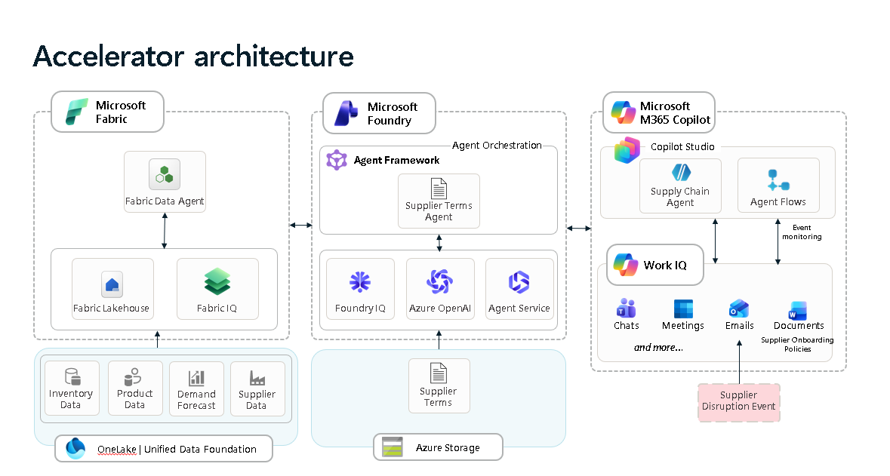

# Solution Architecture and Four Deployment Choices

The solution architecture is depicted below: 

The Microsoft 365 Copilot component, in the center of the solution architecture diagram above, is the main user interface with an AI-enhanced workflow. The Copilot Studio Agent serves as the intelligent ingress point that unifies all three IQ components: **Fabric IQ** (data platform), **Foundry IQ** (knowledge base), and **Work IQ** (workflow orchestration). The workflow and detailed technical components are described in [copilot feature and architecture overview](../docs/copilot/README.md). 

The Microsoft Fabric and Microsoft Foundry components of this solution provide services used by the Copilot Studio Agent. 

The Microsoft Fabric component implements a comprehensive data lakehouse architecture featuring semantic modeling, an ontology-based Fabric data agent with natural language querying capabilities, and interactive dashboards for retail sales and supply chain management. The features and architecture are described in [fabric feature and architecture overview](../docs/fabric/README.md). 

The Microsoft Foundry component is a document-based question answering system using Azure AI Foundry, featuring a Knowledge Base pipeline with intelligent search capabilities, an Azure AI Foundry Agent for natural language document querying, and source citations with direct links to original documents. The features and architecture are described in [foundry feature and architecture overview](../docs/foundry/README.md). 

